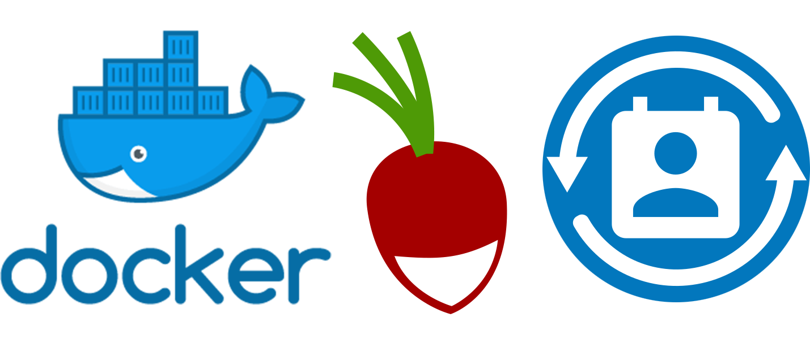

<h1 align="center">Docker-Radicale-DecSync</h1>

Docker image for <a href="https://github.com/39aldo39/Radicale-DecSync">Radicale DecSync</a>, the CalDAV/CardDAV server, with <a href="https://github.com/39aldo39/Radicale-DecSync">Radicale-DecSync</a> enabled out of the box. Synchronize calendars, contacts books & tasks using DecSync & Radicale

## Setup
1. Ensure you have [Docker](https://www.docker.com/) installed
2. Setup [DecSync](https://github.com/39aldo39/DecSync) (easiest on the Android app DecSync CC)
3. Clone the repo
4. Run `mkdir DecSync`
5. Use an application such as [Syncthing](https://github.com/syncthing/syncthing) to sync your your DecSync directory into the new directory. If the sync was successful, the DecSync directory will now contain Principal/calendars, Principal,contacts & Principal/tasks.
7. Run `docker-compose up -d`
8. Configure the server at localhost:5232, by default you can use any username & password to login

## Other Useful Projects
See these projects for more information
- [Radicale](https://github.com/Kozea/Radicale)
- [DecSync](https://github.com/39aldo39/DecSync)
- [Syncthing](https://github.com/syncthing/syncthing)
- [docker-radicale](https://github.com/tomsquest/docker-radicale) 
- [Radicale-DecSync](https://github.com/39aldo39/Radicale-DecSync)

